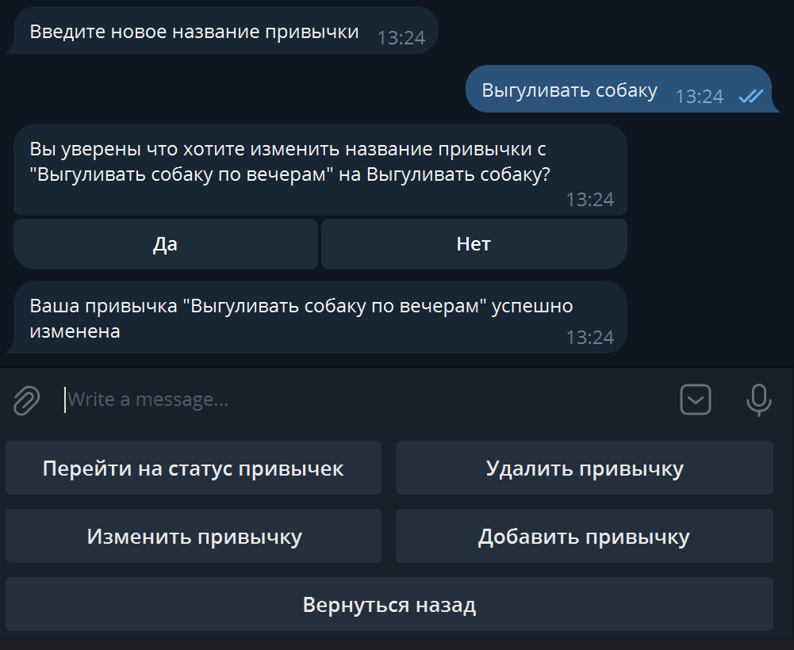

<h1>Бот трекинга привычек</h1>

<h2>Структура проекта:</h2>
<ul>
    <li>config - Конфигурационные настройки бота</li>
    <li>dotinputs - Телеграмм бот</li>
    <li>fast_app - backend и база данных бота</li>
    <li>migrations - Миграции базы данных</li>
    <li>requirements - Зависимости бота и backend</li>
</ul>

<h2>Описание:</h2>

Телеграмм бот который помогает изменить вашу жизнь к лучшему

<h3>Config</h3>

Config предназначен для установки основных настроек и подтягивания переменных окружения из файла .env
Основной класс "Settings" является наследником класса BaseSettings из pydentic_settings.
Экземпляр "env" предназначен для получения доступа к переменным окружения по всему проекту.

Переменные окружения используемые в проекте

<ul>
    <li>
        TOKEN - Токен Телеграмм бота получаемый ботом @botfather из телеграмм
    </li>
    <li>
        PROJECT_NAME - Имя проекта, задается пользователем
    </li>
    <li>
        CORS_ALLOWED_ORIGINS - Разрешенный хост по которому предоставляется доступ совершать запросы к backend
    </li>
    <li>
        MAIN_HOST - Основной хост по которому выполняются запросы к backend
    </li>
    <li>
        DB_USER - Имя пользователя для подключения к БД
    </li>
    <li>
        DB_PASS - Пароль пользователя для подключения к БД
    </li>
    <li>
        DB_NAME - Название БД
    </li>
    <li>
        DB_PORT - Порт для подключения к БД
    </li>
    <li>
        DB_HOST - Хост для подключения к БД
    </li>
    <li>
        database_url_async - асинхронный url адрес для подключения к БД 
    </li>
    <li>
        database_url_sync - синхронный url адрес для подключения к БД
    </li>
</ul>

<h3>Migrations</h3>

Миграции БД выполненняются с помощью alembic. В проекте уже подготовлена первая миграция
которая применится командой "alembic upgrade head" при старте телеграмм бота.

<h3>Requirements</h3>

Зависимости проекта разделены на две группы

<ul>
    <li>
        
Зависимости для бота:

        <ul>
            <li>
                requests - библиотека для выполнения запросов к backend
            </li>
            <li>
                pytelegrambotapi - Основная библиотека на котором написан бот
            </li>
            <li>
                pydantic-settings - Библиотека для подгрузки переменных окружения
            </li>
            <li>
                apscheduler - Библиотека для создания очередей задач на отправку уведомлений о привычках
            </li>
            <li>
                sqlalchemy - ORM для подключения к БД
            </li>
            <li>
                psycopg2-binary - Драйвер для синхронного подключения к БД
            </li>
        </ul>
    </li>
    <li>
        
Зависимости для backend:

        <ul>
            <li>
                fastapi - основной фреймворк backend
            </li>
            <li>
                uvicorn - ASGI сервер для запуска синхронного backend
            </li>
            <li>
                pydantic - библиотека для проверки и сериализации данных
            </li>
            <li>
                pydantic-core - Ядро pydentic
            </li>
            <li>
                httpx - полнофункциональный HTTP-клиент
            </li>
            <li>
                pydantic-settings - Библиотека для подгрузки переменных окружения
            </li>
            <li>
                alembic - Для создания миграций в БД
            </li>
            <li>
                sqlalchemy - ORM для подключения к БД
            </li>
            <li>
                asyncpg - Драйвер для асинхронного подключения к БД
            </li>
        </ul>
    </li>
</ul>

Все завсисимости контролируются и устанавливаются через Poetry

<h3>fast_app</h3>

fast_app - Это backend отвечающий за получение/отправку запросов 
телеграмм бота, а также хранение данных о пользователях, 
и подготовка данных для отправки обртно боту

fast_app состоит из:

<ul>
    <li>
        
backend написан на fastAPI. Основные url адреса выполняют функцию отправки данных
        url адреса с http методами GET.
        удаления данных DELETE, изменения PATCH и добавления данных POST
        

    </li>
    <li>
        
database - Взаимодействие с БД. В database описаны основные Модели данных User, 
        Habit, Tracking. Также описаны основные асинхронные функции для выполнения запросов 
        к БД.
        Взаимодействие с БД выполнено на основе SQLAlchemy с асинхронным подключением к БД
        СУБД используемая в проекте - postgres.
        

    </li>
    <li>
        
schemases - Модели pydentic которые используются для сериализации и подготовки
        необходимой структуры данных перед отправкой боту. Модели pydentic это зеркальное
        отражение моделей БД.
        

    </li>
</ul>

<h3>dotinputs</h3>

dotinputs - Телеграмм бот

dotinputs- Это основной блок на котором держится весь проект.
dotinputs отвечает за состояния пользователя с ботом, а также подготавливает
данные для запросов пользователя и отправляет их обратно

dotinputs написан на основе pytelegrambotapi.
Отправка автоматических уведомлений осуществляется через apscheduler

Все обработчики сообщений разделены на три блока:

<ul>
    <li>
        main_handlers - Основной обработчик в котором сосредоточены основные команды
    </li>
    <li>
        handle_registration - Обработчик-опросник для знакомства бота с пользователем
        во время регистрации.
    </li>
    <li>
        handle_habits - Обработчики сообщений по привычкам пользователя
    </li>
</ul>

Дополнительные функции-помошники вынесены в модуль utils.py. В этом модуле
описаны основные функции для вылидации вводимых данных пользователя, подготовки
интерактивного смс, получения профиля и проверки пользователя на предмет авторизации

Отдельно вынесены шаблоны кнопок телеграмм бота в модуль buttons.py

states.py - Модуль в котором описаны состояния пользователя во время 
регистрации

scheduler - отвечает за организацию и контроль отправки автоматических уведомелний
с заданным сроком. Основная библиотека - apscheduler

scheduler состоит из core.py - подключение к БД и 
BackgroundScheduler который запускает фоновые отдельные потоки.
handle_schedule.py - модуль для контроля над фоновыми потоками

В handle_schedule.py Реаизована логика по добавлению удалению, приостановке
и продолжению потоков. В модуле имеется обработчик сообщений по выполнению
запросов на редактирование статуса привычки.

<h3>Запуск телеграмм бота</h3>

Весь запуск и контроль работы телеграмм бота выполняется через Docker

Запуск бота выполняется через клонирование из удаленного репозитория github 
c последующей подготовкой переменных окружения через файл .env. 
После подготовки телебот запускается через docker командой docker compose up.

Структура проекта реализована таким образом что основные блоки
проекта (bot, backend, database) независимы друг от друга и могут запускаться
на различных серверах или отдельно друг от друга. Но в проекте реализован запуск
всех блоков проекта одним разом через docker-compose.yml

<h2>Взаимодействие бота с пользователем</h2>
<h3>Первое знакомство бота c пользователем</h3>

При вводе команды /start Бот предложит пользователю познакомится 
и зарегестрироваться, задав пользователю ряд вопросов

 

После регистрации бот отправит полученные данные на backend и после этого 
пользователь получит следующие кнопки

Нажимаем на кнопку "Узнать инфо о себе"

Бот выведит информацию о пользователе 
Нажимаем на кнопку "Вкладка с привычками"

Бот перейдет на вкладку с привычками и предоставит кнопки:
Нажимаем на кнопку "Перейти на статус привычек"

Наш спиок привычек пока пуст. Хорошо. Давайте добавим привычку
Нажав на кнопку "Добавить привычку"

Бот задаст несколько вопросов, после которых будет отправлен запрос к backend
на добавление привычки

Нажмем на кнопку "Перейти на статус привычек"

Видим добавленную привычку. Давайте изменим ее
Нажав при этом на кнопку "Изменить привычку"

Бот предложит список ваших привычек для изменеия. Выберим номер 1

Бот предложит изменить каждый параметр по отдельности или все параметры
сразу. Давайте изменим параметр "Название" нажав на соответствующую кнопку

Изменим название на "Выгуливать собаку", после этого бот предложит согласие на изменение
привычки, соглашаемся и привычка изменена. Давайте в этом убедимся нажав на кнопку
"Перейти на статус привычек"

Видим что название привычки изменено. Давайте удалим привычку, нажав на кнопку
"Удалить"

Выбираем номер привычки который хотим удалить и подтверждаем удаление.
Бот отправляет сообщение об успешном выполнении операции.
Что бы в этом убедится перейдем на статус привычек

И видим что наш список привычек пуст. Вернемся назад нажав на кнопку 
"Вернуться назад"

И увидим наш профиль, давайте выйдим из своего профиля 
нажав на кнопку "Выйти из своего профиля"

После выхода из профиля бот не будет вас беспокоить автоматическими напоминаниями. 
имейте это в виду. Чтобы бот постоянно вам напоминал. Вы должны быть
авторизованы. Авторизуемся введя команду /start

Нажмем на кнопку авторизоваться и перейдем в свой профиль

